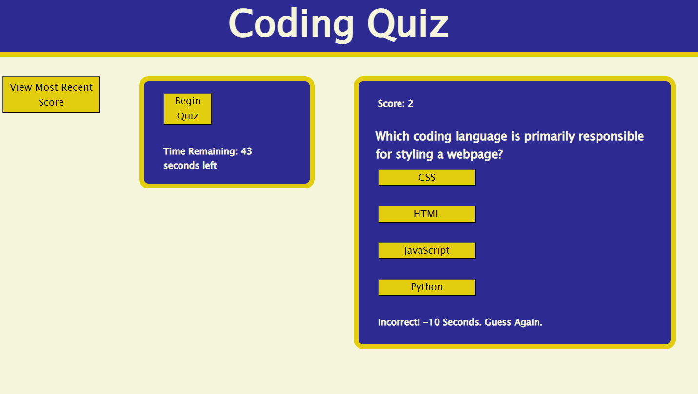

# Coding Quiz

## Description

For this challenge, I built a coding quiz from scratch to demonstrate javascript functionality. The quiz has 10 questions and a 60 second timer.

## Installation

N/A

## Usage

When users load the application, they will see three main components under the header: the View Most Recent Score button, the Timer Section, and the Game Square. If users click on the View Recent Score button, they will see the last score and initials of the person who earned it, retrieved from the browser's local storage. Clicking the Begin Quiz button in the Timer Section will start the timer and randomly pull up the first multiple choice question. After clicking on an answer button, the user is notified if they were correct or incorrect. If the user is correct, the next question is generated. If the user is incorrect, they will lose 10 seconds on the timer and have to guess again. The game ends either all questions have been answered correctly, or when the timer reaches 0 seconds. After the game ends, users will see their score, and will have an opportunity to enter their initials to save that score to local storage to be viewed in the View Recent Score section. 

[Deployed Quiz Application (https://adamjohnson92.github.io/Adam-Johnson-Portfolio/)]

## Credits

Assistance with code provided by BCS tutor Jehyun Jung in the generateQuestion function, regarding the loop variable and the while statement to only generate a question a question if it had not be generated in that game yet. Jehyun also assisted with how to correctly parse the userScoreSubmission object from local storage and get it to display on the Most Recent Score Table. The 10 second penalty deduction was assisted by BCS instructor Rebecca Goldstein to ensure that incorrect answers would be penalized accordingly.

## License

N/A